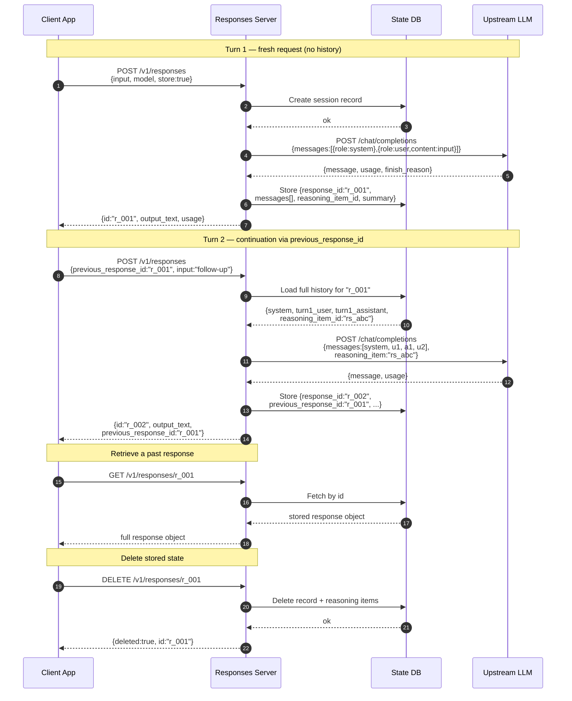
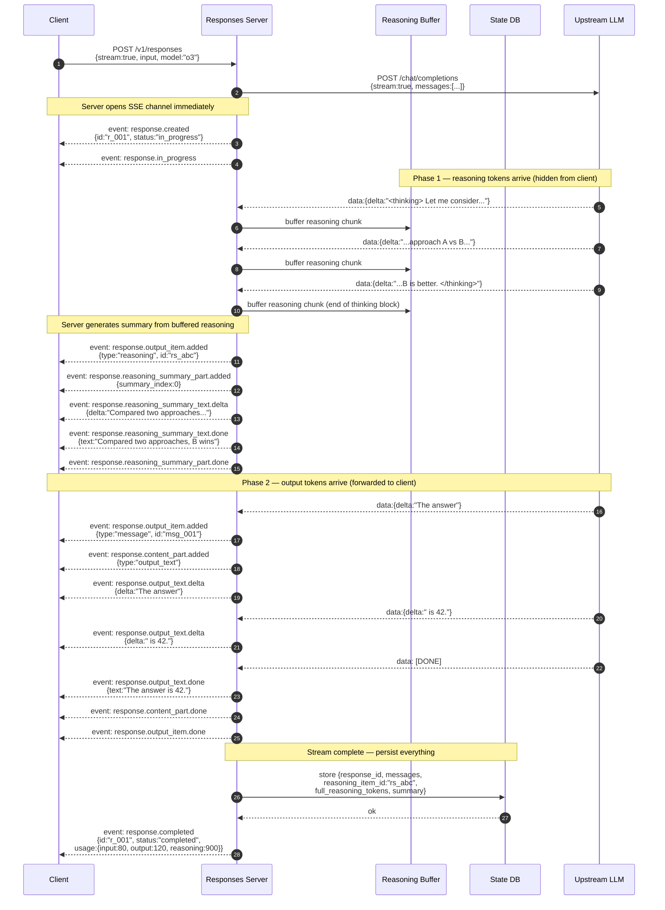
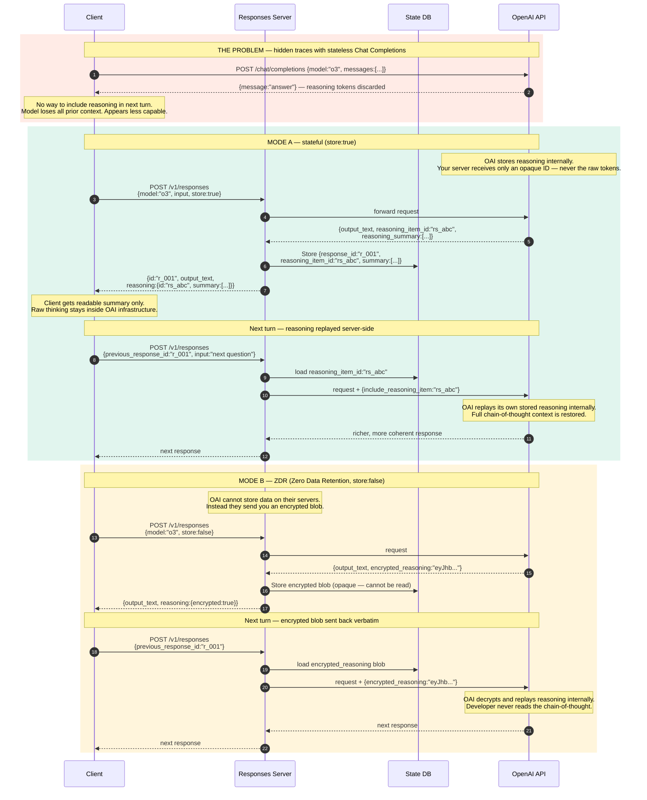
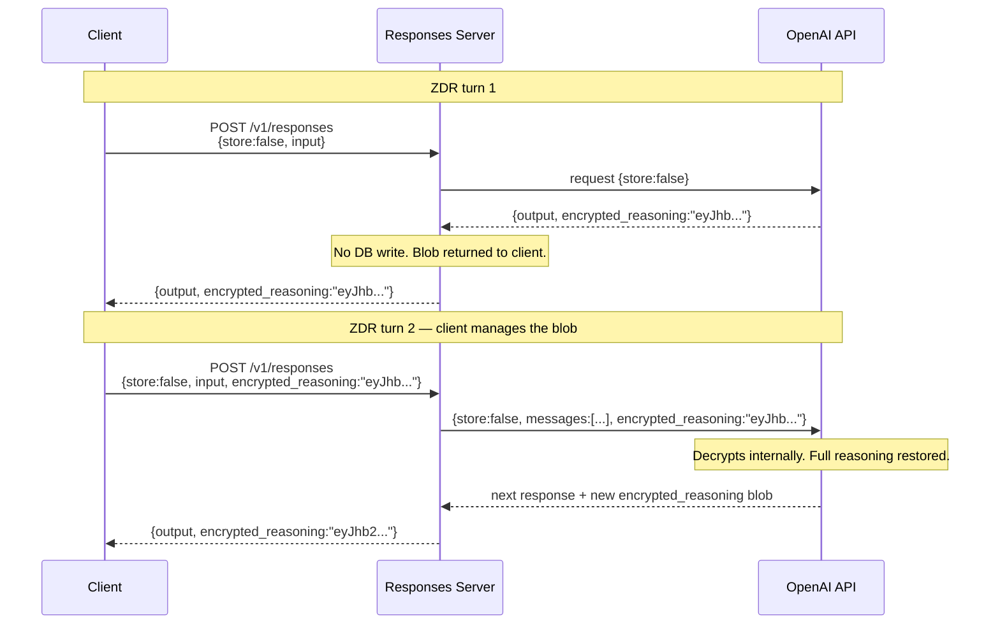

# OpenAI Responses API — Implementation Deep Dive

> **Context:** This document explains how to implement an OpenAI Responses API server backed by an upstream Chat Completions endpoint. It covers stateful session management, stream transcoding, reasoning token handling, and the hidden-trace architecture.

---

## Table of Contents

1. [The Core Problem — Stateless vs. Stateful](#1-the-core-problem)
2. [API Endpoints to Implement](#2-api-endpoints)
3. [Multi-Turn Lifecycle](#3-multi-turn-lifecycle)
4. [Streaming Event Pipeline](#4-streaming-event-pipeline)
5. [Reasoning Trace Architecture](#5-reasoning-trace-architecture)
6. [ZDR Mode — Zero Data Retention](#6-zdr-mode)
7. [Stream Event Reference](#7-stream-event-reference)
8. [State DB Schema](#8-state-db-schema)
9. [Implementation Checklist](#9-implementation-checklist)

---

## 1. The Core Problem

Chat Completions is **stateless** — every request carries the full conversation history. The Responses API is **stateful** — the server owns history and clients reference it by ID. When building a Responses API adapter on top of Chat Completions, your server is the statefulness layer.

```
┌─────────────────────────────────────────────────────────┐
│  Chat Completions — client sends everything every turn  │
│                                                         │
│  Request body (Turn 2):                                 │
│    [system prompt]                                      │
│    [user: "Hello"]               ← replayed every time  │
│    [assistant: "Hi there!"]      ← replayed every time  │
│    [user: "follow-up question"]  ← new input            │
│                                                         │
│  Payload grows O(n) with turns. Reasoning tokens        │
│  are permanently discarded after each turn.             │
└─────────────────────────────────────────────────────────┘

┌─────────────────────────────────────────────────────────┐
│  Responses API — client sends only what's new           │
│                                                         │
│  Request body (Turn 2):                                 │
│    previous_response_id: "r_001"                        │
│    input: "follow-up question"   ← only new input       │
│                                                         │
│  Server resolves r_001 → full history + reasoning item  │
│  Payload is constant size. Reasoning persists.          │
└─────────────────────────────────────────────────────────┘
```

### Why reasoning makes this necessary

OpenAI does **not** expose raw chain-of-thought tokens in API responses. With stateless Chat Completions, the model's internal reasoning is permanently discarded after every turn — the model loses all context about what it previously considered. The Responses API fixes this by keeping reasoning server-side (as either an opaque item ID or an encrypted blob) and replaying it into subsequent requests invisibly.

> **Sean Goedecke's point:** OpenAI is selling the Responses API as "faster and more flexible", but the real reason it exists is to work around their own decision to hide reasoning traces. A provider that exposes chain-of-thought (like Anthropic) doesn't need a stateful API to get full model capability — `/chat/completions` works fine.

---

## 2. API Endpoints

Your server must implement these five endpoints:

| Method | Path | Description |
|--------|------|-------------|
| `POST` | `/v1/responses` | Create a response (streaming or non-streaming) |
| `GET` | `/v1/responses/{id}` | Retrieve a stored response object |
| `DELETE` | `/v1/responses/{id}` | Delete a stored response and its reasoning items |
| `GET` | `/v1/responses/{id}/input_items` | List input items for a response |
| `POST` | `/v1/responses/{id}/cancel` | Cancel an in-progress streaming response |

### Key request fields for `POST /v1/responses`

```jsonc
{
  "model": "o3",
  "input": "What is the capital of France?",   // string or message array
  "previous_response_id": "r_001",             // links to prior turn (optional)
  "instructions": "You are a helpful assistant.", // system prompt
  "stream": true,                              // SSE streaming
  "store": true,                               // persist response server-side (default: true)
  "reasoning": {
    "effort": "medium",                        // low | medium | high
    "summary": "auto"                          // controls reasoning summary output
  },
  "temperature": 1.0,
  "max_output_tokens": 2048,
  "tools": [...],                              // built-in or function tools
  "tool_choice": "auto"
}
```

---

## 3. Multi-Turn Lifecycle

This diagram shows the full CRUD lifecycle: creating a fresh session, continuing via `previous_response_id`, retrieving, and deleting.



### Key implementation notes

- **History reconstruction (steps 9–11):** On every request with a `previous_response_id`, walk the linked list in the DB and reconstruct the full `messages[]` array. The client just sends an ID — your server does all the work.
- **Reasoning item injection (step 11):** Pass the stored `reasoning_item_id` back to the upstream LLM so it can replay its own prior reasoning internally. The tokens never arrive at your server — you just hold the opaque ID.
- **Linked-list structure:** Each response stores `previous_response_id`, forming a chain. You can walk it backward to reconstruct any conversation depth.
- **Race condition:** DB persistence (step 14) happens *after* the response is returned. If a client immediately calls `GET /v1/responses/r_001`, the record may not exist yet. Persist *before* returning the response, or implement a short read-after-write retry loop.

---

## 4. Streaming Event Pipeline

This is the most complex part. The upstream Chat Completions API gives you flat `data:{delta:"..."}` chunks. Your server must transcode these into a rich, typed SSE event hierarchy.



### The reasoning buffer (steps 8–10)

Your server **must fully buffer** the reasoning/thinking block before doing anything else. The thinking block boundary is detected by watching for the closing `</thinking>` tag (or equivalent delimiter for the upstream model). Only once the full thinking block has been buffered can you:

1. Generate the summary (secondary model call, or built-in summarize mode)
2. Emit the `response.reasoning_summary_*` event sequence
3. Begin forwarding output token deltas to the client

This introduces a perceived latency gap: the client sees `response.created` immediately, then waits while the model thinks, then gets the summary, then gets output.

### Token delta forwarding (steps 19–23)

After the thinking block, output tokens are forwarded nearly directly. Each upstream `data:{delta:"..."}` maps to a `response.output_text.delta` event. Your server wraps them in the item/part lifecycle but adds minimal latency.

### SSE frame format

Every event follows this structure:

```
event: response.output_text.delta
data: {"type":"response.output_text.delta","item_id":"msg_001","output_index":0,"content_index":0,"delta":"Hello","sequence_number":14}

```

The `sequence_number` is a monotonically incrementing integer per response. Clients use it to detect and reorder out-of-order frames.

---

## 5. Reasoning Trace Architecture

This diagram illustrates **why** the Responses API exists and the two modes your server must support.



### The key insight (Sean Goedecke)

The Responses API is being marketed as a general improvement over Chat Completions, but the actual driver is OpenAI's decision to hide reasoning traces. Models like Claude or DeepSeek, which expose full chain-of-thought, work perfectly with stateless Chat Completions — you just include the thinking block in the next turn's `messages[]`. OpenAI can't offer this because exposing reasoning might leak information about model internals or create safety liabilities.

The two escape hatches are:
- **Mode A (store:true):** Reasoning stays on OpenAI's servers. Your server holds an opaque ID.
- **Mode B (store:false/ZDR):** Reasoning is returned encrypted. Your server stores and relays a blob it cannot read.

In both cases the developer never sees the raw chain of thought.

---

## 6. ZDR Mode — Zero Data Retention

When `store: false`, no conversation data may be persisted on the provider's servers. Your adapter must:

1. **Skip all DB writes** for messages, outputs, and reasoning items
2. **Receive an encrypted reasoning blob** from the upstream instead of a `reasoning_item_id`
3. **Return the blob to the client** (the client is now responsible for passing it back)
4. **On subsequent turns**, accept the blob from the client and forward it verbatim to the upstream



The encrypted blob grows slightly each turn as it accumulates new reasoning context. Clients must treat it as an opaque, required field — attempting to modify or omit it will produce degraded model performance.

---

## 7. Stream Event Reference

Your SSE stream must emit events in this exact lifecycle order. Every event carries a monotonically increasing `sequence_number`.

### Lifecycle events (always emitted)

| Event | When |
|-------|------|
| `response.created` | Immediately on request receipt, before upstream call |
| `response.in_progress` | After upstream connection established |
| `response.completed` | After stream ends and DB write succeeds |
| `response.failed` | If upstream errors or rate-limits |
| `response.cancelled` | If `POST /v1/responses/{id}/cancel` is called |

### Output item events

| Event | When |
|-------|------|
| `response.output_item.added` | First token of a new output item (message, reasoning, tool_call, etc.) |
| `response.output_item.done` | Item fully received |
| `response.content_part.added` | New content part within an item |
| `response.content_part.done` | Content part complete |

### Text delta events

| Event | When |
|-------|------|
| `response.output_text.delta` | Each output token chunk |
| `response.output_text.done` | Full assembled text of the item |
| `response.refusal.delta` | Each refusal token chunk |
| `response.refusal.done` | Full assembled refusal text |

### Reasoning summary events

| Event | When |
|-------|------|
| `response.reasoning_summary_part.added` | After reasoning buffer is fully consumed and summary begins |
| `response.reasoning_summary_text.delta` | Each summary token chunk |
| `response.reasoning_summary_text.done` | Full assembled summary text |
| `response.reasoning_summary_part.done` | Summary part complete |

### Tool call events

| Event | When |
|-------|------|
| `response.function_call_arguments.delta` | Each token of function call arguments |
| `response.function_call_arguments.done` | Full assembled arguments string |

### Usage event

| Event | When |
|-------|------|
| `response.completed` | Carries `usage:{input_tokens, output_tokens, reasoning_tokens}` |

---

## 8. State DB Schema

Your persistence layer needs at minimum these tables:

```sql
-- Core response record
CREATE TABLE responses (
    id                   TEXT PRIMARY KEY,           -- "r_001"
    previous_response_id TEXT REFERENCES responses(id),
    model                TEXT NOT NULL,
    status               TEXT NOT NULL,              -- in_progress | completed | failed | cancelled
    instructions         TEXT,                       -- system prompt
    output_text          TEXT,
    reasoning_item_id    TEXT,                       -- opaque ID from upstream (Mode A)
    encrypted_reasoning  TEXT,                       -- encrypted blob (Mode B / ZDR)
    reasoning_summary    JSONB,                      -- [{type:"summary_text", text:"..."}]
    usage                JSONB,                      -- {input_tokens, output_tokens, reasoning_tokens}
    store                BOOLEAN NOT NULL DEFAULT TRUE,
    created_at           TIMESTAMPTZ DEFAULT now(),
    completed_at         TIMESTAMPTZ
);

-- Reconstructed messages for history replay
CREATE TABLE response_messages (
    id          SERIAL PRIMARY KEY,
    response_id TEXT REFERENCES responses(id) ON DELETE CASCADE,
    position    INT NOT NULL,
    role        TEXT NOT NULL,   -- system | user | assistant | tool
    content     JSONB NOT NULL,
    tool_call_id TEXT            -- for tool result messages
);

-- Index for fast chain walking
CREATE INDEX idx_responses_previous ON responses(previous_response_id);
CREATE INDEX idx_messages_response  ON response_messages(response_id, position);
```

### History reconstruction algorithm

```python
def reconstruct_messages(response_id: str, db) -> list[dict]:
    """
    Walk the linked list from response_id back to the root,
    collect all messages in order, then replay them forward.
    """
    chain = []
    cursor = response_id

    # Walk backward collecting response IDs
    while cursor:
        row = db.query("SELECT * FROM responses WHERE id = ?", cursor)
        chain.append(row)
        cursor = row.previous_response_id

    chain.reverse()  # oldest first

    messages = []
    for response in chain:
        # Add system prompt from root only
        if response == chain[0] and response.instructions:
            messages.append({"role": "system", "content": response.instructions})

        # Add all messages for this turn
        turn_msgs = db.query(
            "SELECT * FROM response_messages WHERE response_id = ? ORDER BY position",
            response.id
        )
        messages.extend([{"role": m.role, "content": m.content} for m in turn_msgs])

    return messages
```

---

## 9. Implementation Checklist

### Core endpoints
- [ ] `POST /v1/responses` — non-streaming path
- [ ] `POST /v1/responses` — streaming path (SSE)
- [ ] `GET /v1/responses/{id}` — retrieve stored response
- [ ] `DELETE /v1/responses/{id}` — delete response + cascade reasoning items
- [ ] `GET /v1/responses/{id}/input_items` — list input items
- [ ] `POST /v1/responses/{id}/cancel` — cancel in-progress stream

### Session management
- [ ] Create session record before upstream call
- [ ] Walk `previous_response_id` chain to reconstruct `messages[]`
- [ ] Inject `reasoning_item_id` into upstream call on continuation
- [ ] Store new response with pointer to previous
- [ ] Handle `store: false` — skip all DB writes, return encrypted blob to client

### Stream transcoding
- [ ] Open SSE connection and emit `response.created` before upstream call
- [ ] Detect reasoning/thinking block boundaries in upstream stream
- [ ] Buffer full reasoning block before generating summary
- [ ] Emit `response.reasoning_summary_*` event sequence
- [ ] Forward output token deltas as `response.output_text.delta`
- [ ] Emit item/part lifecycle events (`output_item.added`, `content_part.added`, etc.)
- [ ] Assign monotonically increasing `sequence_number` to every event
- [ ] Emit `response.completed` with final `usage` (including `reasoning_tokens`)
- [ ] Handle `response.failed` and `response.cancelled` paths

### Reasoning summarization
- [ ] Choose summarization strategy: secondary model call, structured prompt, or upstream native `summarize_mode`
- [ ] Store full reasoning tokens in DB (for your own records, never expose to client)
- [ ] Store compact summary in DB for retrieval via `GET /v1/responses/{id}`
- [ ] Handle ZDR encrypted blob: store opaque, relay verbatim on next turn

### Edge cases
- [ ] Handle context window overflow: truncate early turns or re-summarize old segments
- [ ] Handle `response.completed` → `GET` race: persist before emitting `completed` or implement retry
- [ ] Validate that `previous_response_id` belongs to the same user/org
- [ ] Handle mid-stream `cancel` — flush any buffered reasoning, emit `response.cancelled`
- [ ] Propagate upstream `finish_reason: "length"` as `status: "incomplete"` with appropriate `incomplete_details`

---

## Summary

| Concern | Chat Completions | Responses API (your adapter) |
|---------|-----------------|------------------------------|
| History ownership | Client | Server (DB) |
| Payload size | Grows O(n) | Constant |
| Reasoning tokens | Discarded or exposed | Hidden; stored as opaque ID or encrypted blob |
| Reasoning continuity | None (for hidden-trace models) | Restored each turn via ID or encrypted blob |
| Streaming events | Flat `data:{delta}` | Typed hierarchical SSE event sequence |
| State cleanup | N/A | `DELETE /v1/responses/{id}` |

The Responses API is fundamentally a **reasoning continuity layer** wrapped in a convenience API. Every design decision — stateful sessions, typed SSE events, encrypted reasoning blobs — exists to solve the problem of preserving and replaying hidden chain-of-thought across turns.