# Deep Research: How OpenAI Responses API Works Behind the Scenes for Summarization

## Executive Summary

The OpenAI Responses API represents a fundamental architectural shift from the traditional Chat Completions API. Instead of a simple request-response pattern, it employs an **event-driven, stateful architecture** with sophisticated server-side context management and automatic summarization (compaction). This enables long-running AI agents that can process millions of tokens across hundreds of tool calls without losing context.

---

## 1. Architecture Overview

### 1.1 Core Design Philosophy

The Responses API is built around **agentic primitives** rather than simple chat interfaces:

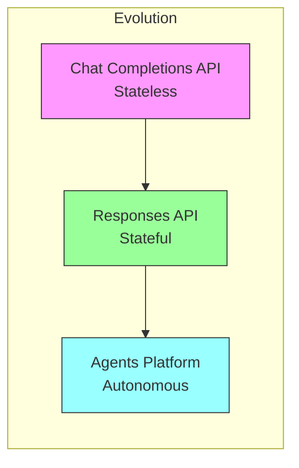
```mermaid
graph LR
    subgraph Evolution
        A[Chat Completions API<br/>Stateless] --> B[Responses API<br/>Stateful]
        B --> C[Agents Platform<br/>Autonomous]
    end
    
    style A fill:#f9f,stroke:#333
    style B fill:#9f9,stroke:#333
    style C fill:#9ff,stroke:#333
```

**Key architectural differences:**

| Aspect | Chat Completions | Responses API |
|--------|------------------|---------------|
| State | Stateless - you manage history | Stateful - server manages context |
| Streaming | Undifferentiated token stream | 53+ typed semantic events |
| Tools | Function calling pattern | First-class tool support |
| Context | Manual truncation/summarization | Automatic server-side compaction |
| Multi-turn | Resend full history | `previous_response_id` chaining |

### 1.2 Event-Driven Architecture

Unlike Chat Completions' continuous token append pattern, Responses API emits **structured semantic events**:

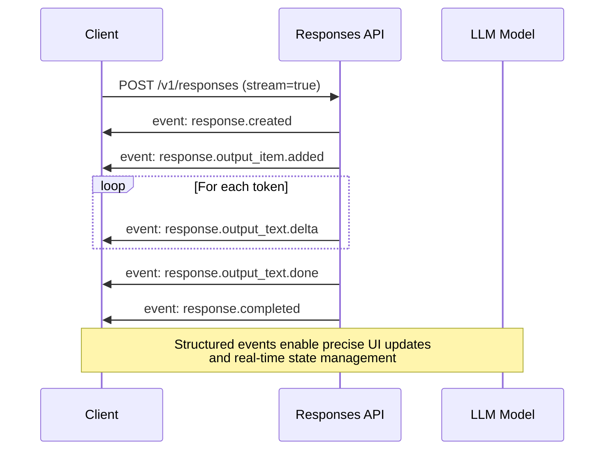
```mermaid
sequenceDiagram
    participant Client
    participant API as Responses API
    participant Model as LLM Model
    
    Client->>API: POST /v1/responses (stream=true)
    API->>Client: event: response.created
    API->>Client: event: response.output_item.added
    loop For each token
        API->>Client: event: response.output_text.delta
    end
    API->>Client: event: response.output_text.done
    API->>Client: event: response.completed
    
    Note over Client,Model: Structured events enable precise UI updates<br/>and real-time state management
```

This enables:
- Precise UI updates
- Real-time state management
- Tool call interleaving
- Progress tracking for long operations

---

## 2. State Management Mechanisms

### 2.1 Three Approaches to Conversation State

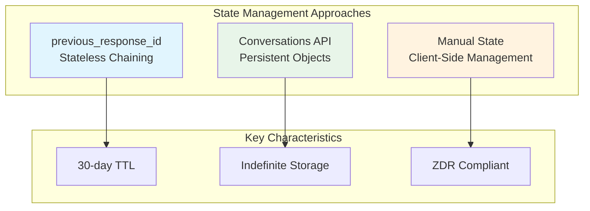
```mermaid
flowchart TB
    subgraph Methods[State Management Approaches]
        direction TB
        M1[previous_response_id<br/>Stateless Chaining]
        M2[Conversations API<br/>Persistent Objects]
        M3[Manual State<br/>Client-Side Management]
    end
    
    subgraph Features[Key Characteristics]
        F1[30-day TTL]
        F2[Indefinite Storage]
        F3[ZDR Compliant]
    end
    
    M1 --> F1
    M2 --> F2
    M3 --> F3
    
    style M1 fill:#e1f5fe
    style M2 fill:#e8f5e9
    style M3 fill:#fff3e0
```

#### **Method 1: `previous_response_id` (Stateless Chaining)**

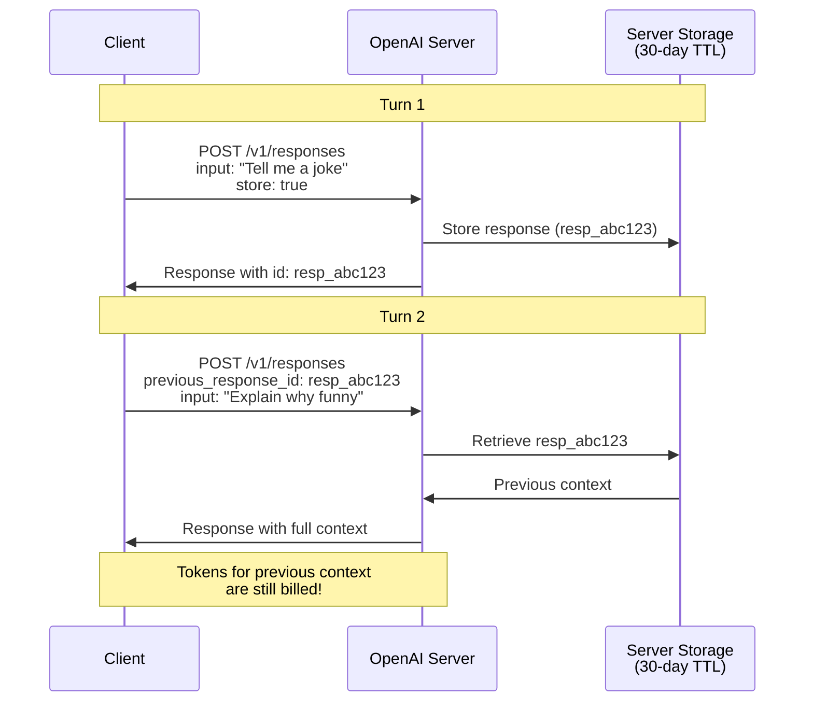
```mermaid
sequenceDiagram
    participant Client
    participant Server as OpenAI Server
    participant Storage as Server Storage<br/>(30-day TTL)
    
    Note over Client,Storage: Turn 1
    Client->>Server: POST /v1/responses<br/>input: "Tell me a joke"<br/>store: true
    Server->>Storage: Store response (resp_abc123)
    Server->>Client: Response with id: resp_abc123
    
    Note over Client,Storage: Turn 2
    Client->>Server: POST /v1/responses<br/>previous_response_id: resp_abc123<br/>input: "Explain why funny"
    Server->>Storage: Retrieve resp_abc123
    Storage->>Server: Previous context
    Server->>Client: Response with full context
    
    Note over Client,Server: Tokens for previous context<br/>are still billed!
```

```python
# First turn
response = client.responses.create(
    model="gpt-4o",
    input="Tell me a joke",
    store=True
)

# Second turn - only send new input, reference previous response
second_response = client.responses.create(
    model="gpt-4o",
    previous_response_id=response.id,  # Key mechanism
    input=[{"role": "user", "content": "Explain why that's funny"}]
)
```

**How it works internally:**
- OpenAI stores the previous response server-side (30-day TTL by default)
- When you reference `previous_response_id`, the server retrieves and appends the prior context
- The model sees the full conversation history without you resending it
- **All previous input tokens are still billed** - you're paying for the convenience, not saving tokens

#### **Method 2: Conversations API (Persistent Objects)**

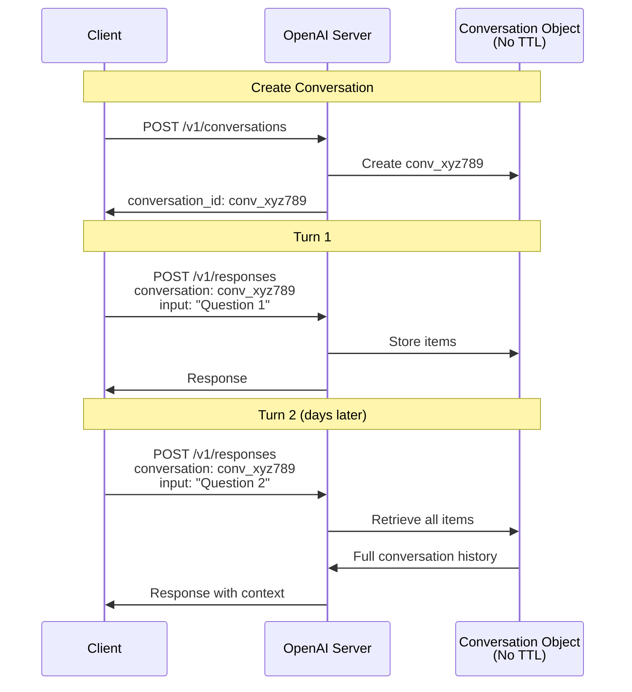
```mermaid
sequenceDiagram
    participant Client
    participant Server as OpenAI Server
    participant Conv as Conversation Object<br/>(No TTL)
    
    Note over Client,Conv: Create Conversation
    Client->>Server: POST /v1/conversations
    Server->>Conv: Create conv_xyz789
    Server->>Client: conversation_id: conv_xyz789
    
    Note over Client,Conv: Turn 1
    Client->>Server: POST /v1/responses<br/>conversation: conv_xyz789<br/>input: "Question 1"
    Server->>Conv: Store items
    Server->>Client: Response
    
    Note over Client,Conv: Turn 2 (days later)
    Client->>Server: POST /v1/responses<br/>conversation: conv_xyz789<br/>input: "Question 2"
    Server->>Conv: Retrieve all items
    Conv->>Server: Full conversation history
    Server->>Client: Response with context
```

```python
# Create a durable conversation object
conversation = openai.conversations.create()

# Use it across multiple responses
response = openai.responses.create(
    model="gpt-4.1",
    input=[{"role": "user", "content": "What are the 5 Ds of dodgeball?"}],
    conversation="conv_689667905b048191b4740501625afd940c7533ace33a2dab"
)
```

**Key differences from `previous_response_id`:**
- No 30-day TTL - conversations persist indefinitely
- Can span sessions, devices, or jobs
- Stores messages, tool calls, tool outputs as "items"
- Designed for long-term agent memory

#### **Method 3: Manual State Management**

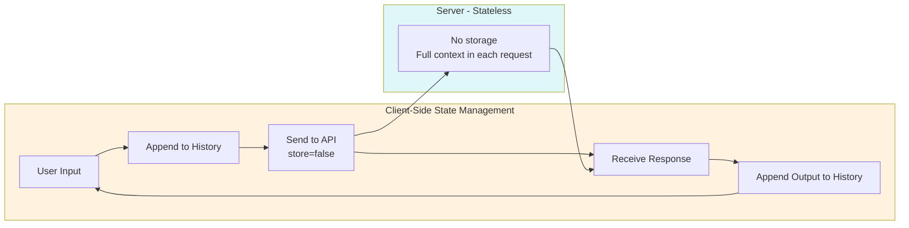
```mermaid
flowchart LR
    subgraph ClientSide[Client-Side State Management]
        direction TB
        A[User Input] --> B[Append to History]
        B --> C[Send to API<br/>store=false]
        C --> D[Receive Response]
        D --> E[Append Output to History]
        E --> A
    end
    
    subgraph ServerSide[Server - Stateless]
        F[No storage<br/>Full context in each request]
    end
    
    C --> F
    F --> D
    
    style ClientSide fill:#fff3e0
    style ServerSide fill:#e0f7fa
```

```python
history = [{"role": "user", "content": "Hello"}]
response = client.responses.create(model="gpt-4o", input=history, store=False)

# Manually append output to history
history += [{"role": el.role, "content": el.content} for el in response.output]
history.append({"role": "user", "content": "Next message"})
```

**When to use:**
- Zero Data Retention (ZDR) compliance requirements
- Maximum control over context
- Reproducible/deterministic workflows

---

## 3. Compaction: The Core Summarization Mechanism

### 3.1 The Context Window Problem

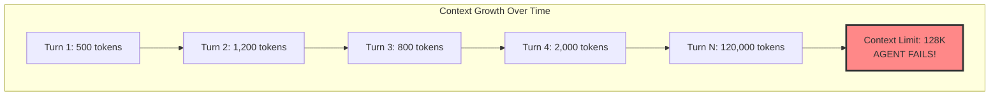
```mermaid
graph TB
    subgraph ContextGrowth[Context Growth Over Time]
        T1[Turn 1: 500 tokens]
        T2[Turn 2: 1,200 tokens]
        T3[Turn 3: 800 tokens]
        T4[Turn 4: 2,000 tokens]
        TN[Turn N: 120,000 tokens]
        LIMIT[Context Limit: 128K<br/>AGENT FAILS!]
        
        T1 --> T2 --> T3 --> T4 --> TN --> LIMIT
    end
    
    style LIMIT fill:#f88,stroke:#333,stroke-width:3px
```

Every message, tool call, and output consumes tokens. A typical agent workflow:
```
Turn 1:  500 tokens
Turn 2:  1,200 tokens (includes tool output)
Turn 3:  800 tokens
...
Turn 50: 120,000 tokens → Context limit reached!
```

**The challenge:** Models have hard context limits (128K for GPT-4o, 200K for some models). Without intervention, agents fail mid-task.

### 3.2 Server-Side Compaction

This is the breakthrough feature for long-running agents.

#### **How Compaction Works:**

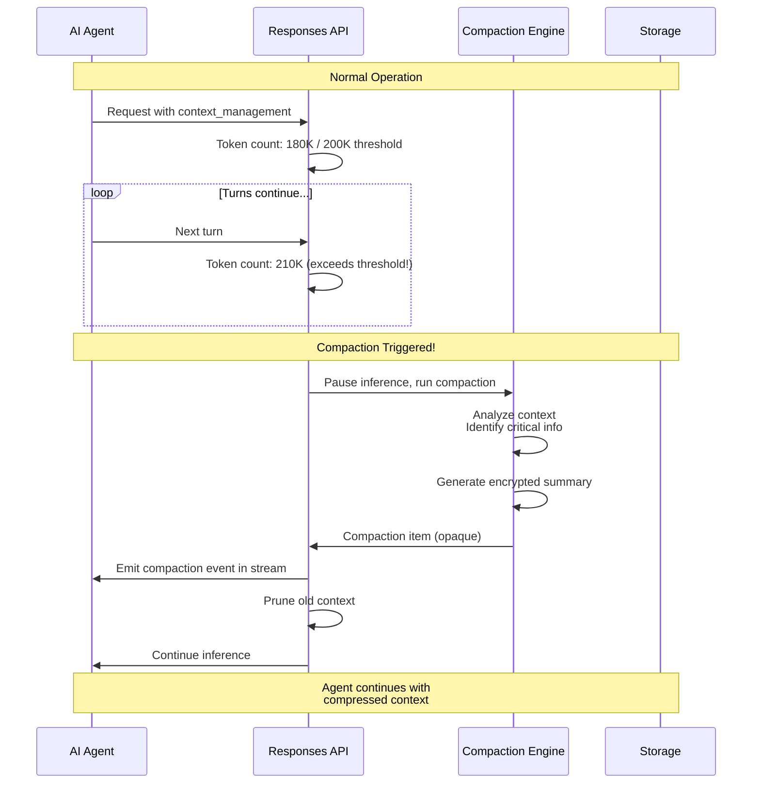
```mermaid
sequenceDiagram
    participant Agent as AI Agent
    participant API as Responses API
    participant Compactor as Compaction Engine
    participant Storage
    
    Note over Agent,Storage: Normal Operation
    Agent->>API: Request with context_management
    API->>API: Token count: 180K / 200K threshold
    
    loop Turns continue...
        Agent->>API: Next turn
        API->>API: Token count: 210K (exceeds threshold!)
    end
    
    Note over Agent,Storage: Compaction Triggered!
    API->>Compactor: Pause inference, run compaction
    Compactor->>Compactor: Analyze context<br/>Identify critical info
    Compactor->>Compactor: Generate encrypted summary
    Compactor->>API: Compaction item (opaque)
    API->>Agent: Emit compaction event in stream
    API->>API: Prune old context
    API->>Agent: Continue inference
    
    Note over Agent,Storage: Agent continues with<br/>compressed context
```

```python
response = client.responses.create(
    model="gpt-5.3-codex",
    input=conversation,
    store=False,
    context_management=[{
        "type": "compaction", 
        "compact_threshold": 200000  # Trigger at 200K tokens
    }]
)
```

#### **Compaction Strategy - What Gets Preserved:**

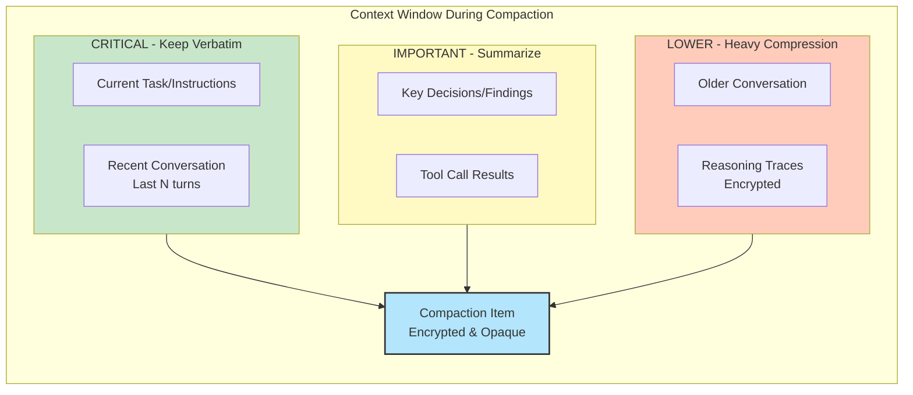
```mermaid
graph TB
    subgraph ContextWindow[Context Window During Compaction]
        direction TB
        
        subgraph Critical[CRITICAL - Keep Verbatim]
            C1[Current Task/Instructions]
            C2[Recent Conversation<br/>Last N turns]
        end
        
        subgraph Important[IMPORTANT - Summarize]
            I1[Key Decisions/Findings]
            I2[Tool Call Results]
        end
        
        subgraph Lower[LOWER - Heavy Compression]
            L1[Older Conversation]
            L2[Reasoning Traces<br/>Encrypted]
        end
        
        Critical --> Summary[Compaction Item<br/>Encrypted & Opaque]
        Important --> Summary
        Lower --> Summary
    end
    
    style Critical fill:#c8e6c9
    style Important fill:#fff9c4
    style Lower fill:#ffccbc
    style Summary fill:#b3e5fc,stroke:#333,stroke-width:2px
```

**The compaction item is encrypted/opaque:**
- Carries forward "key prior state and reasoning"
- Not human-interpretable
- Contains compressed representation of critical context
- Works with ZDR (`store=false`)

#### **Real-world results (from Triple Whale's Moby agent):**
- **5 million tokens** processed in a single session
- **150+ tool calls** without accuracy degradation
- **~39x effective context window** (5M / 128K = 39)

### 3.3 Standalone Compaction Endpoint

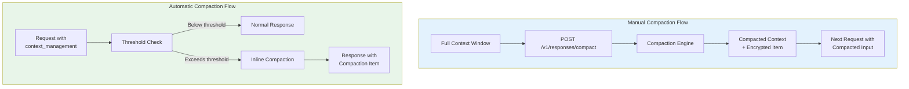
```mermaid
flowchart TB
    subgraph Manual[Manual Compaction Flow]
        A[Full Context Window] --> B[POST /v1/responses/compact]
        B --> C[Compaction Engine]
        C --> D[Compacted Context<br/>+ Encrypted Item]
        D --> E[Next Request with<br/>Compacted Input]
    end
    
    subgraph Automatic[Automatic Compaction Flow]
        F[Request with<br/>context_management] --> G[Threshold Check]
        G -->|Below threshold| H[Normal Response]
        G -->|Exceeds threshold| I[Inline Compaction]
        I --> J[Response with<br/>Compaction Item]
    end
    
    style Manual fill:#e3f2fd
    style Automatic fill:#e8f5e9
```

For explicit control, use `/v1/responses/compact`:

```python
# Manual compaction flow
long_input_items = [...]  # Your full context

# Compact the current window
compacted = client.responses.compact(
    model="gpt-5.4",
    input=long_input_items
)

# Use compacted output for next turn
next_input = [
    *compacted.output,  # Includes encrypted compaction item
    {"type": "message", "role": "user", "content": "Continue..."}
]

next_response = client.responses.create(
    model="gpt-5.4",
    input=next_input,
    store=False
)
```

---

## 4. WebSocket Mode for Long-Running Agents

### 4.1 Persistent Connections

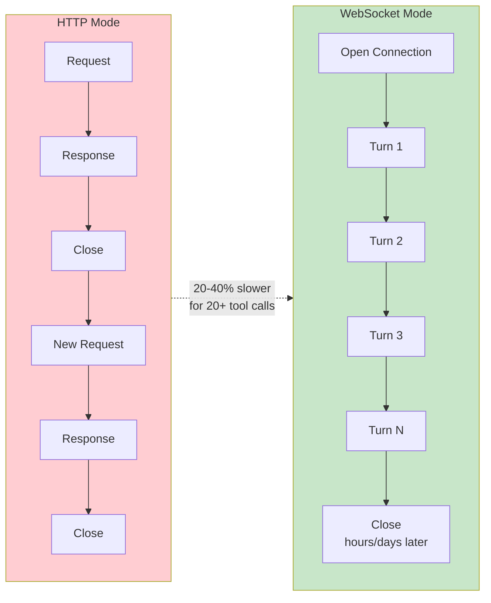
```mermaid
flowchart LR
    subgraph HTTP[HTTP Mode]
        direction TB
        H1[Request] --> H2[Response]
        H2 --> H3[Close]
        H3 --> H4[New Request]
        H4 --> H5[Response]
        H5 --> H6[Close]
    end
    
    subgraph WS[WebSocket Mode]
        direction TB
        W1[Open Connection] --> W2[Turn 1]
        W2 --> W3[Turn 2]
        W3 --> W4[Turn 3]
        W4 --> W5[Turn N]
        W5 --> W6[Close<br/>hours/days later]
    end
    
    HTTP -.->|20-40% slower<br/>for 20+ tool calls| WS
    
    style HTTP fill:#ffcdd2
    style WS fill:#c8e6c9
```

**Benefits:**
- **20-40% faster** for 20+ tool calls (per OpenAI)
- Connection-local cache keeps most recent response in memory
- Lower latency for continuation

### 4.2 Connection-Local State

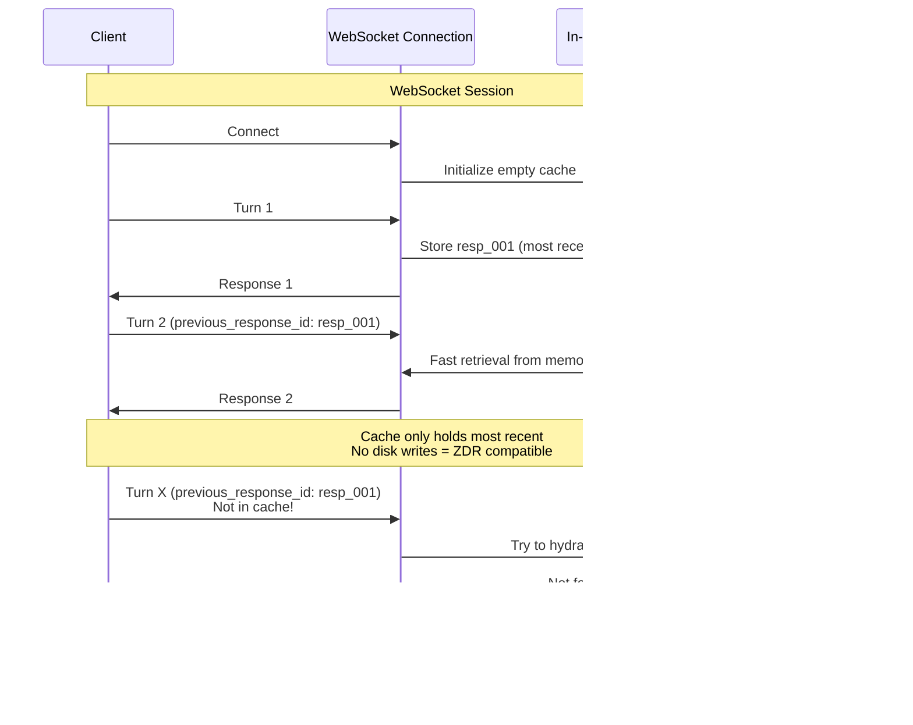
```mermaid
sequenceDiagram
    participant Client
    participant WS as WebSocket Connection
    participant Cache as In-Memory Cache
    participant Storage as Persistent Storage
    
    Note over Client,Storage: WebSocket Session
    Client->>WS: Connect
    WS->>Cache: Initialize empty cache
    
    Client->>WS: Turn 1
    WS->>Cache: Store resp_001 (most recent)
    WS->>Client: Response 1
    
    Client->>WS: Turn 2 (previous_response_id: resp_001)
    Cache->>WS: Fast retrieval from memory
    WS->>Client: Response 2
    
    Note over Client,Storage: Cache only holds most recent<br/>No disk writes = ZDR compatible
    
    Client->>WS: Turn X (previous_response_id: resp_001)<br/>Not in cache!
    WS->>Storage: Try to hydrate (if store=true)
    Storage-->>WS: Not found / Error
    WS->>Client: previous_response_not_found error
```

**Important:** The cache is in-memory only, not written to disk. This means:
- Compatible with `store=false` and ZDR
- Fast for continuous sessions
- Must handle `previous_response_not_found` errors

---

## 5. Token Management & Optimization

### 5.1 Token Budgeting

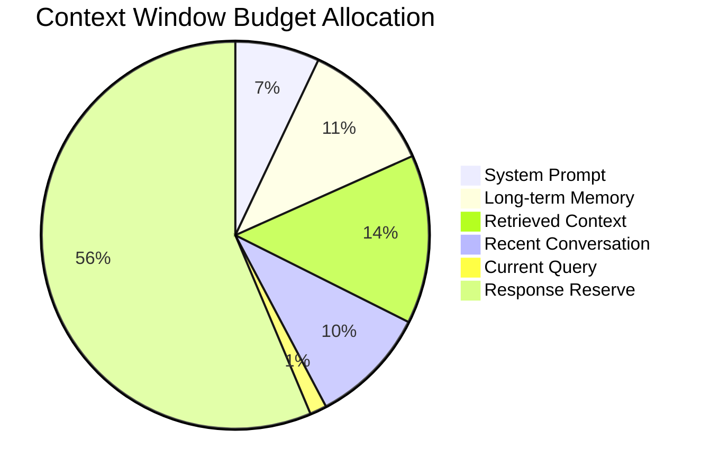
```mermaid
pie title Context Window Budget Allocation
    "System Prompt" : 500
    "Long-term Memory" : 800
    "Retrieved Context" : 1000
    "Recent Conversation" : 700
    "Current Query" : 100
    "Response Reserve" : 4000
```

The Responses API provides granular control:

```python
response = client.responses.create(
    model="gpt-4o",
    input=conversation,
    max_output_tokens=4096,
    truncation="auto"  # Enable automatic truncation
)
```

**Parameters:**
- `truncation_strategy`: How to truncate when approaching limits
- `max_prompt_tokens`: Limit input tokens
- `max_output_tokens`: Limit output tokens

### 5.2 Best Practices for Long Context

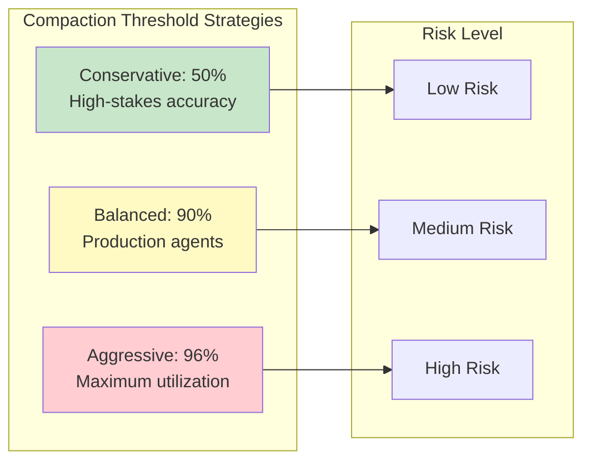
```mermaid
graph LR
    subgraph Thresholds[Compaction Threshold Strategies]
        T1[Conservative: 50%<br/>High-stakes accuracy]
        T2[Balanced: 90%<br/>Production agents]
        T3[Aggressive: 96%<br/>Maximum utilization]
    end
    
    subgraph Risk[Risk Level]
        R1[Low Risk]
        R2[Medium Risk]
        R3[High Risk]
    end
    
    T1 --> R1
    T2 --> R2
    T3 --> R3
    
    style T1 fill:#c8e6c9
    style T2 fill:#fff9c4
    style T3 fill:#ffcdd2
```

| Strategy | Threshold | Use Case |
|----------|-----------|----------|
| Conservative | 50% of context window | High-stakes accuracy |
| Balanced | 90% of context window | Production agents |
| Aggressive | 96% of context window | Maximum utilization |

**Codex's approach (90% ceiling):**
```rust
let context_limit = context_window.map(|w| (w * 9) / 10);  // Hard 90% ceiling
```

---

## 6. How Compaction Compares to Other Approaches

### 6.1 Client-Side vs Server-Side Compaction

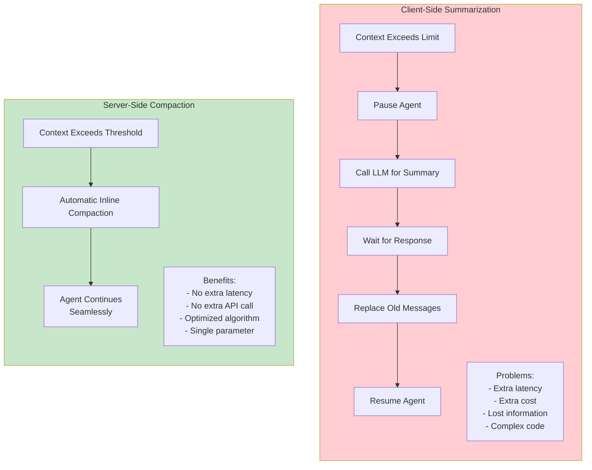
```mermaid
flowchart TB
    subgraph ClientSide[Client-Side Summarization]
        direction TB
        C1[Context Exceeds Limit] --> C2[Pause Agent]
        C2 --> C3[Call LLM for Summary]
        C3 --> C4[Wait for Response]
        C4 --> C5[Replace Old Messages]
        C5 --> C6[Resume Agent]
        
        note1[Problems:<br/>- Extra latency<br/>- Extra cost<br/>- Lost information<br/>- Complex code]
    end
    
    subgraph ServerSide[Server-Side Compaction]
        direction TB
        S1[Context Exceeds Threshold] --> S2[Automatic Inline Compaction]
        S2 --> S3[Agent Continues<br/>Seamlessly]
        
        note2[Benefits:<br/>- No extra latency<br/>- No extra API call<br/>- Optimized algorithm<br/>- Single parameter]
    end
    
    style ClientSide fill:#ffcdd2
    style ServerSide fill:#c8e6c9
```

Traditional approach used by most agent frameworks:

```python
# When context exceeds threshold:
# 1. Take full conversation history
# 2. Call LLM with summarization prompt
# 3. Replace old messages with summary

summary = client.chat.completions.create(
    model="gpt-4o-mini",
    messages=[
        {"role": "system", "content": "Summarize this conversation..."},
        *old_messages
    ]
)
```

### 6.2 Server-Side Compaction Advantages

| Aspect | Client-Side | Server-Side Compaction |
|--------|-------------|------------------------|
| Latency | Extra API call | Inline during streaming |
| Implementation | Complex | Single parameter |
| Quality | Varies by prompt | OpenAI-optimized |
| Reasoning traces | Lost | Encrypted preservation |
| Cost | Extra summarization call | Built into inference |

---

## 7. Data Retention & Privacy

### 7.1 Default Behavior

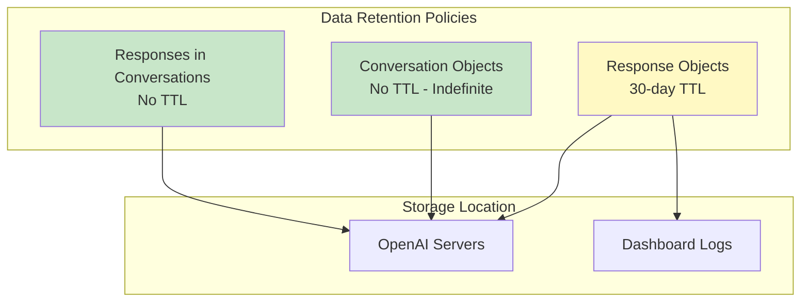
```mermaid
graph TB
    subgraph Retention[Data Retention Policies]
        R1[Response Objects<br/>30-day TTL]
        R2[Conversation Objects<br/>No TTL - Indefinite]
        R3[Responses in Conversations<br/>No TTL]
    end
    
    subgraph Storage[Storage Location]
        S1[OpenAI Servers]
        S2[Dashboard Logs]
    end
    
    R1 --> S1
    R1 --> S2
    R2 --> S1
    R3 --> S1
    
    style R1 fill:#fff9c4
    style R2 fill:#c8e6c9
    style R3 fill:#c8e6c9
```

| Data Type | Retention |
|-----------|-----------|
| Response objects | 30 days TTL |
| Conversation objects | No TTL (indefinite) |
| Responses attached to conversations | No TTL |

### 7.2 Zero Data Retention (ZDR)

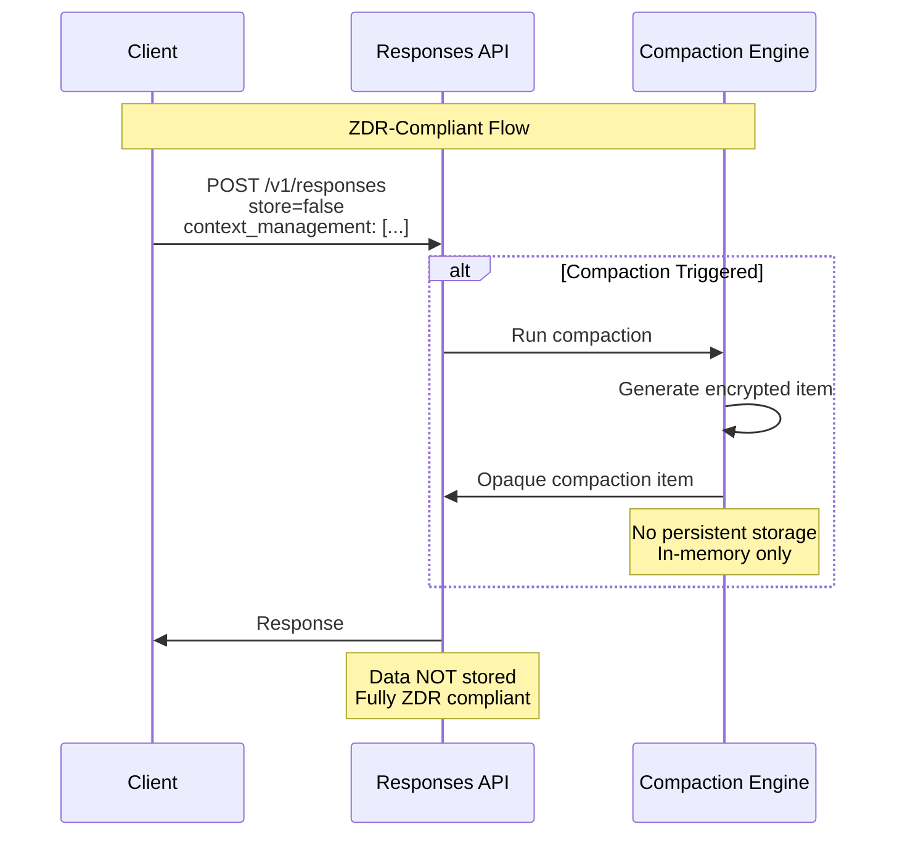
```mermaid
sequenceDiagram
    participant Client
    participant API as Responses API
    participant Compaction as Compaction Engine
    
    Note over Client,Compaction: ZDR-Compliant Flow
    Client->>API: POST /v1/responses<br/>store=false<br/>context_management: [...]
    
    alt Compaction Triggered
        API->>Compaction: Run compaction
        Compaction->>Compaction: Generate encrypted item
        Compaction->>API: Opaque compaction item
        Note over Compaction: No persistent storage<br/>In-memory only
    end
    
    API->>Client: Response
    Note over API: Data NOT stored<br/>Fully ZDR compliant
```

```python
response = client.responses.create(
    model="gpt-4o",
    input=conversation,
    store=False  # ZDR-compliant
)
```

**With compaction:**
- Compaction item is encrypted
- Carries forward context without persistent storage
- Fully ZDR-friendly

---

## 8. Practical Implementation Patterns

### 8.1 Long-Running Agent Loop with Compaction

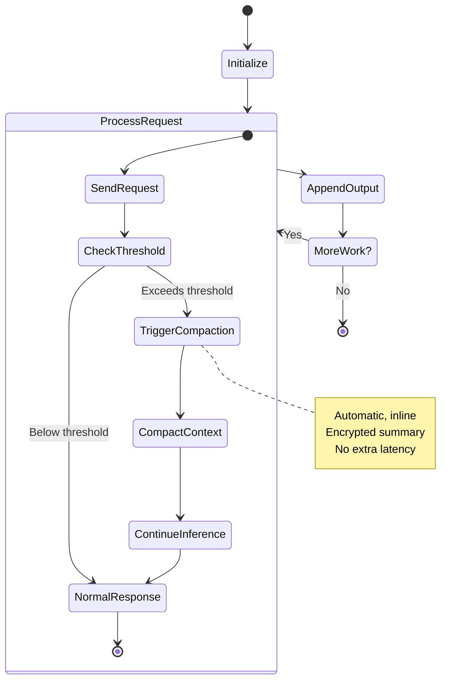
```mermaid
stateDiagram-v2
    [*] --> Initialize
    Initialize --> ProcessRequest
    
    state ProcessRequest {
        [*] --> SendRequest
        SendRequest --> CheckThreshold
        CheckThreshold --> NormalResponse: Below threshold
        CheckThreshold --> TriggerCompaction: Exceeds threshold
        TriggerCompaction --> CompactContext
        CompactContext --> ContinueInference
        ContinueInference --> NormalResponse
        NormalResponse --> [*]
    }
    
    ProcessRequest --> AppendOutput
    AppendOutput --> MoreWork?
    
    MoreWork? --> ProcessRequest: Yes
    MoreWork? --> [*]: No
    
    note right of TriggerCompaction
        Automatic, inline
        Encrypted summary
        No extra latency
    end note
```

```python
conversation = [{"type": "message", "role": "user", "content": "Start task"}]

while keep_going:
    response = client.responses.create(
        model="gpt-5.3-codex",
        input=conversation,
        store=False,
        context_management=[{
            "type": "compaction", 
            "compact_threshold": 200000
        }]
    )
    
    # Append output (includes compaction items when triggered)
    conversation.extend(response.output)
    
    # Add next user input
    conversation.append({
        "type": "message",
        "role": "user",
        "content": get_next_input()
    })
```

### 8.2 Error Handling

```python
# Handle compaction-related errors
errors_to_handle = [
    "previous_response_not_found",  # ID not in cache
    "websocket_connection_limit_reached",  # 60-minute limit
]
```

---

## 9. Streaming Events Reference

The Responses API uses 53+ typed events organized into categories:

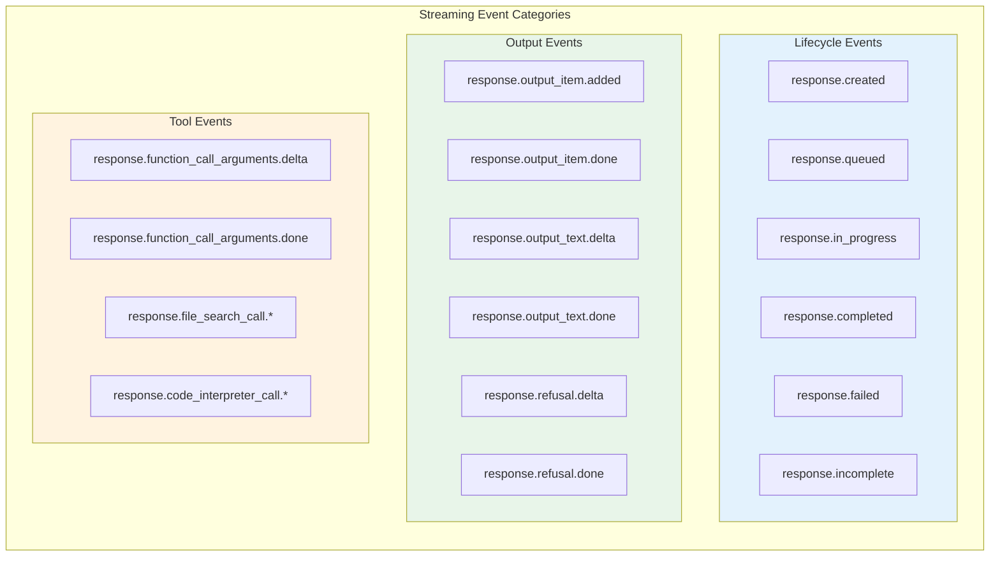
```mermaid
graph TB
    subgraph Events[Streaming Event Categories]
        direction TB
        
        subgraph Lifecycle[Lifecycle Events]
            L1[response.created]
            L2[response.queued]
            L3[response.in_progress]
            L4[response.completed]
            L5[response.failed]
            L6[response.incomplete]
        end
        
        subgraph Output[Output Events]
            O1[response.output_item.added]
            O2[response.output_item.done]
            O3[response.output_text.delta]
            O4[response.output_text.done]
            O5[response.refusal.delta]
            O6[response.refusal.done]
        end
        
        subgraph Tools[Tool Events]
            T1[response.function_call_arguments.delta]
            T2[response.function_call_arguments.done]
            T3[response.file_search_call.*]
            T4[response.code_interpreter_call.*]
        end
    end
    
    style Lifecycle fill:#e3f2fd
    style Output fill:#e8f5e9
    style Tools fill:#fff3e0
```

### Lifecycle Events
- `response.created` - Request accepted
- `response.queued` - Awaiting processing
- `response.in_progress` - Generation started
- `response.completed` - Successful completion
- `response.failed` - Error occurred
- `response.incomplete` - Truncated generation

### Output Events
- `response.output_item.added` - New output item created
- `response.output_item.done` - Output item complete
- `response.output_text.delta` - Text chunk
- `response.output_text.done` - Text complete
- `response.refusal.delta` - Refusal chunk
- `response.refusal.done` - Refusal complete

### Tool Events
- `response.function_call_arguments.delta` - Function arg chunk
- `response.function_call_arguments.done` - Function args complete
- `response.file_search_call.in_progress`
- `response.file_search_call.searching`
- `response.file_search_call.completed`
- `response.code_interpreter_call.in_progress`
- `response.code_interpreter_call.code_delta`
- `response.code_interpreter_call.interpreting`

---

## 10. Key Takeaways

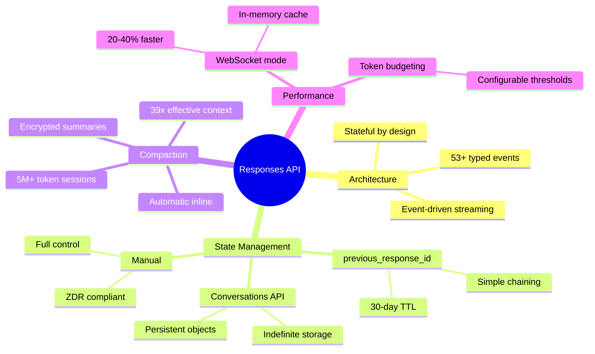
```mermaid
mindmap
  root((Responses API))
    Architecture
      Event-driven streaming
      53+ typed events
      Stateful by design
    State Management
      previous_response_id
        30-day TTL
        Simple chaining
      Conversations API
        Indefinite storage
        Persistent objects
      Manual
        ZDR compliant
        Full control
    Compaction
      Automatic inline
      Encrypted summaries
      5M+ token sessions
      39x effective context
    Performance
      WebSocket mode
        20-40% faster
        In-memory cache
      Token budgeting
        Configurable thresholds
```

1. **Responses API is stateful by design** - OpenAI manages context server-side, enabling `previous_response_id` chaining without resending history.

2. **Compaction is the breakthrough** - Automatic, inline summarization that can extend effective context to 5M+ tokens.

3. **Reasoning traces are preserved internally** - Critical for models like GPT-5 Thinking where chain-of-thought is proprietary.

4. **Three state management approaches** - Choose based on your needs:
   - `previous_response_id`: Simple chaining, 30-day TTL
   - `conversation`: Persistent objects, indefinite storage
   - Manual: Maximum control, ZDR-friendly

5. **WebSocket mode for high-frequency agents** - 20-40% faster for 20+ tool calls, but requires connection lifecycle management.

6. **Compaction is opaque** - The compressed representation is encrypted and not human-interpretable, but carries critical state forward.

---

## 11. References

- OpenAI Conversation State Guide: https://developers.openai.com/docs/guides/conversation-state
- OpenAI Compaction Guide: https://developers.openai.com/api/docs/guides/context-management
- OpenAI Streaming Responses: https://developers.openai.com/api/docs/guides/streaming-responses
- Context Summarization with Realtime API: https://developers.openai.com/cookbook/examples/context_summarization_with_realtime_api
- OpenAI Agentic Primitives Guide: https://www.sitepoint.com/openai-agentic-primitives-guide-skills-shell-compaction/

---

*Research conducted: 2026-03-26*
